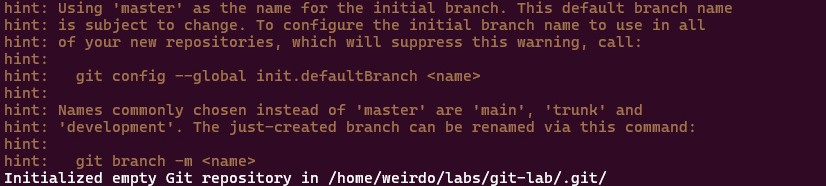
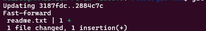
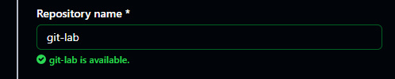
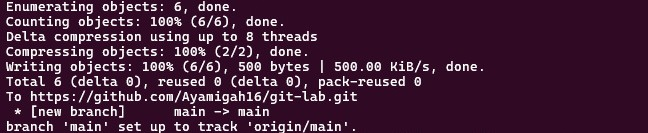

# Git Repository Management Lab

This project is a practical exercise designed to help you understand and apply essential Git and GitHub commands.  
By completing this lab, you will learn how to initialize a repository, track changes, create branches, merge work, and push your code to GitHub.

---

## **Prerequisite**

- [Have git installed](https://git-scm.com/install/)

- [Have a Github Account](https://github.com/signup)

---

## **Learning Objectives**
- Configure Git for the first time  
- Initialize a local Git repository  
- Track and commit changes  
- Create and work on branches  
- Merge branches into `main`  
- Connect a local project to GitHub  
- Push changes to a remote repository  
- View commit history  

---

## **Lab Tasks Overview**

### **Task 1 — Configure Git**
Set up your identity:

```bash
git config --global user.name "Your Name"
git config --global user.email "your@email.com"
git config --global --list
```

### **Task 2 — Initialize a Local Repository**
```bash
mkdir git-lab
cd git-lab
git init
```

- Output:



- Note: To change from ***master*** to ***main**
```bash
git branch -m master main
```
### **Task 3 — Create Your First Commit**

```bash
echo "Hello Git!" > readme.txt
git status
git add readme.txt
git commit -m "Initial commit: Added readme file"
```

### **Task 4 — Create and Work on a Branch**

```bash
git branch feature-update
git checkout feature-update
echo "New feature added!" >> readme.txt
git add readme.txt
git commit -m "Updated readme with new feature text"
```


### **Task 5 — Merge the Branch Back to Main**

```bash
git checkout main
git merge feature-update
```

- Output:



### **Task 6 — Connect to GitHub**
- Create a new GitHub repository named git-lab


- Add GitHub as a remote:

```bash
git remote add origin https://github.com/<username>/git-lab.git
```

- Push your work:

```bash
git push -u origin main
```
- Output:



### Task 7 — View Commit History

```bash
git log --oneline --graph
```


## End-of-Lab Deliverables

- By the end of this lab, you should have:

- A fully initialized local Git repository

- At least two commits

- A feature branch created and merged

- A GitHub repository with all commits pushed

- A visible commit history showing branching and merging

---

## Optional Challenges (For Mastery)
- Challenge 1: Undo a Commit
```bash
git revert <commit-id>
```

- Challenge 2: Clone the Repository
```bash
git clone https://github.com/<username>/git-lab.git
```
